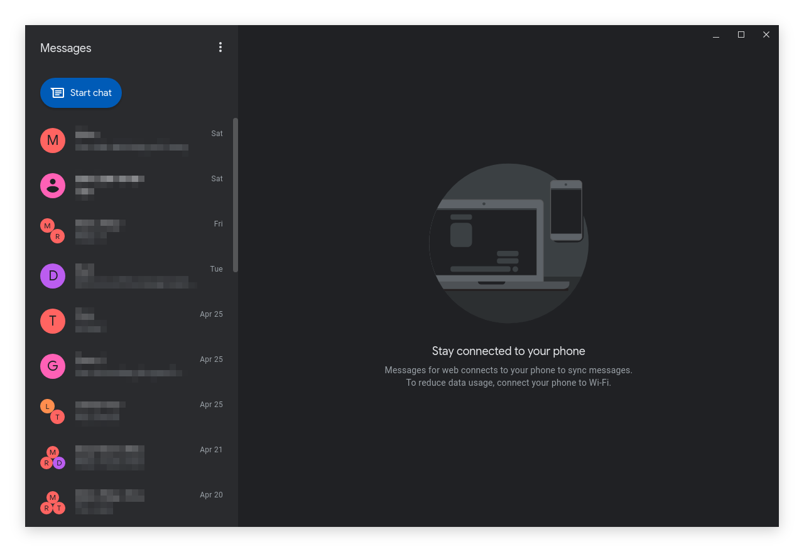

# Android Messages Desktop

This is an Electron application that wraps the Android Messages Web client for use on the desktop. Unlike [nparsons08's project](https://github.com/nparsons08/android-messages), this repository will provide pre-built packages for all three major platforms.

In addition, it also has:
* Custom CSS injection along with Glasstron, allowing you to make it look how you want it to.
* Tray icon for displaying notifications even when the main window is closed.

## To do

* Tray icon with dot for notification.
* Load stylesheets from both app dir and user data.
* Test on each platform.
* Ensure updater works.

### Long-term

* Preferences window for:
	* CSS location
	* Minimize to tray
	* Tray icon style
	* Start on login
* Localization?
